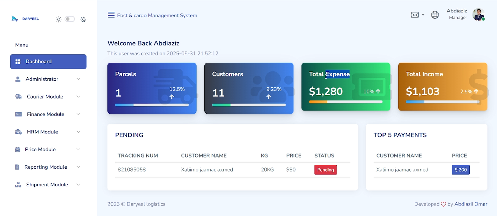

# 📦 Daryeel Post & Cargo Management System

This is a comprehensive, modern, and user-friendly web application designed to streamline the operations of any post or cargo logistics business. It provides a centralized dashboard for tracking shipments, managing customers, overseeing finances, and coordinating courier activities.

## 🛠️ Technology Stack

This application is built using modern web technologies:

- **🎨 Frontend**: HTML, CSS, JavaScript
- **⚙️ Backend**: PHP
- **🗄️ Database**: MySQL

## ✨ Key Features

The system is built to provide Managers and Administrators with real-time insights and tools for efficient operations.

### 📊 Real-Time Dashboard Overview

The primary dashboard (as seen in the image) offers a quick, high-level view of the business's current state:

- **📦 Parcel Metrics**: Track the total number of parcels in the system, along with recent changes (e.g., $1$ Parcel total with a $12.5\%$ increase shown).

- **👥 Customer Management**: Monitor the total number of customers registered and their growth (e.g., $11$ Customers total with a $9.23\%$ increase shown).

- **💰 Financial Insights**:

  - **Total Expense**: Quick view of outgoing costs (e.g., $\$1,280$ total with a $10\%$ increase shown).
  - **Total Income**: Quick view of generated revenue (e.g., $\$1,103$ total with a $2.5\%$ increase shown).

- **⏳ Pending Shipments**: Easily identify and manage parcels that require immediate attention (e.g., Tracking Num: 821085058 for Xalimo jaamac axmed, $20KG$, Price: $\$80$, with Status: Pending).

- **💳 Top 5 Payments**: Highlight recent or high-value customer transactions for financial monitoring.

### ⚙️ Modular System Architecture

The application is structured into distinct, powerful modules accessible via the sidebar menu:

- **👨‍💼 Administrator**: For high-level user and system configuration management.

- **🚚 Courier Module**: Dedicated tools for managing courier staff, assignments, and delivery routes.

- **💵 Finance Module**: Comprehensive features for handling accounts, transactions, invoicing, and generating financial reports.

- **👔 HRM Module**: For managing human resources, employee records, and payroll.

- **💲 Price Module**: Allows administrators to define, update, and manage different pricing structures for various parcel types, weights, and destinations.

- **📈 Reporting Module**: Generate detailed reports on shipments, finances, couriers, and customer activity.

- **📮 Shipment Module**: The core module for creating, updating, and tracking every parcel from pickup to delivery.

## 🖼️ Dashboard Screenshot

Here is a visual representation of the main dashboard:


## 💻 Installation and Setup

(Add specific instructions here on how to set up your project. For example:)

### Clone the repository:

```bash
git clone [Your Repository URL]
```

### Install dependencies:

```bash
cd daryeel-cargo-system

npm install

# or composer install (depending on your tech stack)
```

### Configure environment:

Create a `.env` file and set your database credentials.

### Run Migrations:

```bash
php artisan migrate
```

### Start the server:

```bash
php artisan serve
```

## 📜 License

This project is **free** and open-source. It is licensed under the MIT License
